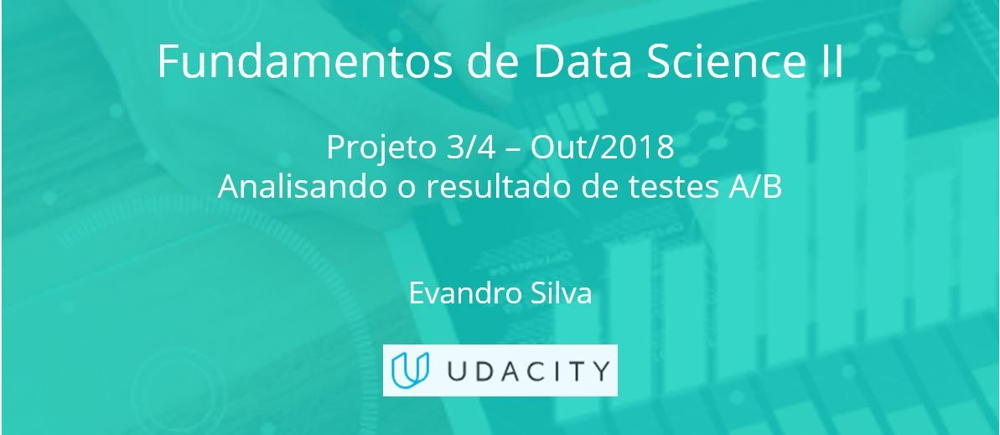

### Nanodegree - Fundamentos de Data Science II - Projeto 3 de 4 (UDACITY)

#### Projeto/Necessidade de negócio: 
- Def_Proj - Analisando o resultado de testes AB.pdf

#### Entrega: 
- Report - Analisando o resultado de testes AB.html
- Analisando o resultado de testes AB.ipynb

#### Avaliação do cliente:
 - Udacity Reviews.pdf